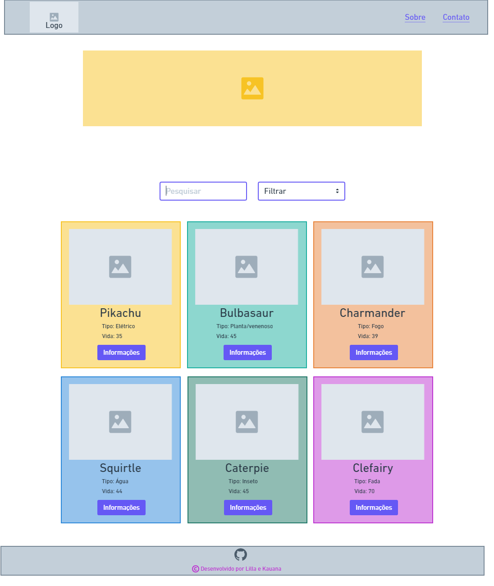
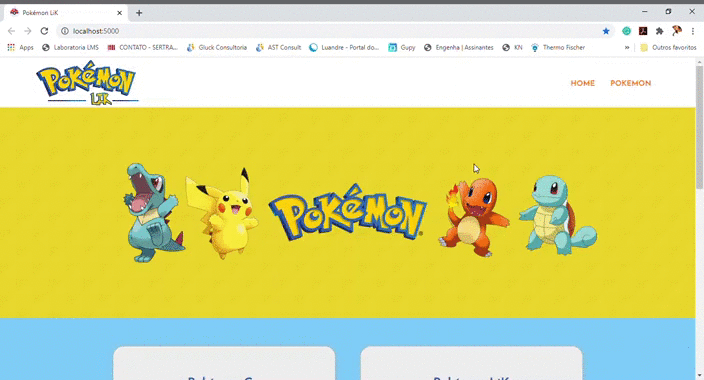
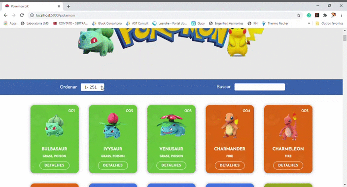

# Data Lovers - Pokémon
## Pokémon LiK

***

### Índice

* [1. Introdução](#1-introdução)
* [2. Histórias de Usuário](#2-histórias-de-usuários)
  * [ProtoPersona](#protopersona)
  * [Protótipo de Baixa Fidelidade](#protótipo-de-baixa-fidelidade)
* [3. Pokémon LiK](#3-pokémon-lik)
* [4. Teste de Usabilidade](#4-teste-de-usabilidade)
* [5. Colocando a mão na massa](#5-colocando-a-mao-na-massa)
* [6. Considerações Finais](#6-considerações-finais)

***

### 1. Introdução

Desenvolvido em duplas para a segunda etapa do Bootcamp da [Laboratória Brasil](https://www.laboratoria.la/br), com o objetivo de manipular dados onde os mesmos se convertam em **informação** fazendo com que os usuários consigam visualizar o que estão buscando.

Para esse projeto tínhamos uma série de dados (temas) diferentes em que poderíamos escolher com que tipo de dados gostaríamos de trabalhar.

A partir da escolha dos dados iniciamos o projeto, nosso projeto é voltado para usuários que jogam ou desejam conhecer o jogo **Pokémon Go**.

A seguir falaremos mais sobre o assunto.

***

### 2. Histórias de Usuário

A partir da definição do tema do projeto iniciamos ele buscando entender melhor quem seria os nossos usuários, suas histórias e ProtoPersonas para assim iniciar o desenvolvimento do protótipo.

Definimos que a nossa aplicação seria desenvolvida para pessoas que gostariam de iniciar a jogar o jogo Pokémon Go, e pessoas que já jogam o mesmo e necessitam de informações específicas de seus Pokémons.

Com isso chegamos em nossas histórias de usuários, nem todas achamos interessante colocar em prática no projeto, porém documentamos todas:

#### *ProtoPersona*

Toda a aplicação foi desenvolvida com base em nossas duas ProtoPersonas abaixo:

* *ProtoPersona 1 - Caio*

* *ProtoPersona 2 - Rosana*

#### *Protótipo de Baixa Fidelidade*

Iniciamos o projeto desenvolvendo um protótipo de nossa aplicação, preferimos já fazê-lo através de ferramentas digitais.

Nosso projeto se iniciaria com a seguinte cara:

* *Home Page*

Inicialmente o `header` era composto da Logo no canto esquerdo a logo e do menu de navegação no canto direito.

Abaixo viria uma imagem que remete ao tema da aplicação, uma breve explicação sobre o jogo, um vídeo referente o mesmo assunto.

E para finalizar a **Home Page** no `Footer` ficaria os dados das desenvolvedoras.

* *Pokémon Page*

Para a página onde ficaria as informações dos dados manipulados, manteríamos o `Header` e o `Footer`, trazendo um padrão para as páginas do site.

Essa página será o coração da aplicação, é nela que manipulamos os dados e exibimos os mesmos aos nossos úsuarios.

Composta de uma barra de filtragem e uma barra de busca, abaixo assim que carregada já traria todos os Pokémons, com algumas informações frontais juntamente da foto, e um botão de `Informações` no card onde assim que clicado exibiria mais informações do personagem escolhido.

***

### 3. Pokémon LiK

Após a análise dos dados de usuários e a implementação do protótipo de baixa fidelidade, iniciamos o desenvolvimento da nossa aplicação. Os relatos nos trouxeram claramente o que precisaríamos apresentar no projeto.

O **Pokémon LiK** nasceu da necessidade dos usuários e futuros usuários necessitarem uma aplicação onde traga informações necessárias para conhecer o jogo e informações mais avançadas dos Pokémons onde auxilia os mestres Pokémons a aprimorar suas jogadas.

Pensando na experiência de nossos usuários a aplicação é totalmente responsiva, ou seja, ela pode ser visualizada sem problemas a partir de diversos tamanhos de tela: celulares, tablets, notebooks, etc..

Agora chega de tanto falar e vamos apresentar um pouco o projeto a vocês, ele inicia com a página `Home` onde traz a Logo do projeto o menu de navegação e informações sobre o projeto e sobre o jogo. 

O projeto conta também com uma segunda página, a página `Pokémon` você consegue inicialmente visualizar todos os pokémons em ordem crescente de número em cards.

Nessa página você conta com um menu de ordenação e busca, onde você poderá ordenar sua pesquisa, ou até mesmo filtrar sua busca por **Nome ou Tipo**.

* *Menu Ordenação dos Cards*

   

 Você conta também com a exibição dos Pokémons em cards, e ao clicar no Botão `Detalhes` de cada Card, lhe é apresentado mais informações sobre o Pokémon Escolhido.

* *Card Pokémon Frente*

  

* *Card Pokémon Modal*

  

***

### 4. Teste de Usabilidade

Conforme programávamos algumas funcionalidades solicitávamos opiniões de pessoas próximas que conhecem o jogo, com isso fomos melhorando visualização de parâmetros e localização de funções e necessidade de botões.

Percebemos também a necessidade de alterar os parâmetros inicialmente informados no protótipo na apresentação do Card e nos filtros e ordenações.

***

### 5. Colocando a mão na massa

Gostou do projeto? Você poderá testá-lo, clicando no link abaixo.

[Pokémonn LiK](https://lillabordignon.github.io/SAP005-data-lovers/)

Você será direcionado para página e já pode começar a pesquisar se Pokémon preferido.

Ou se preferir você pode baixar o projeto em seu computador.

Para rodar o projeto você precisará ter instalado em seu computador *Git* e *Node.js*.
Após instalar as ferramentas acima você através do seu terminal, fará o **clone** do projeto e instalará todas as dependências.

Finalizando esse processo, você dará o comando no terminal "npm start" e em seguida já poderá acessá-lo através do diretório local.

***

### 6. Considerações Finais

Esse projeto trouxe uma complexidade e um desafio um pouco maior ao nosso aprendizado.

Foi muito interessante e divertido trabalhar em equipe (dupla), com isso conseguimos entender um pouco melhor a dinâmica de um grupo de trabalho programando a mesma aplicação.

Agradecemos muito a Laboratória por nos desafiar sempre a aprender cada dia mais, aos colegas que foram fundamentais nesse processo, aos mentores e suas maravilhosas oficinas e dicas, e não menos importante aos nosso familiares e amigos, que nem sempre podem nos ajudar com dicas técnicas mas sempre nos incentivam, nos apoiam e estão dispostos a ouvir nossos desabafos.

- **_Pokémon LiK_**
  

***